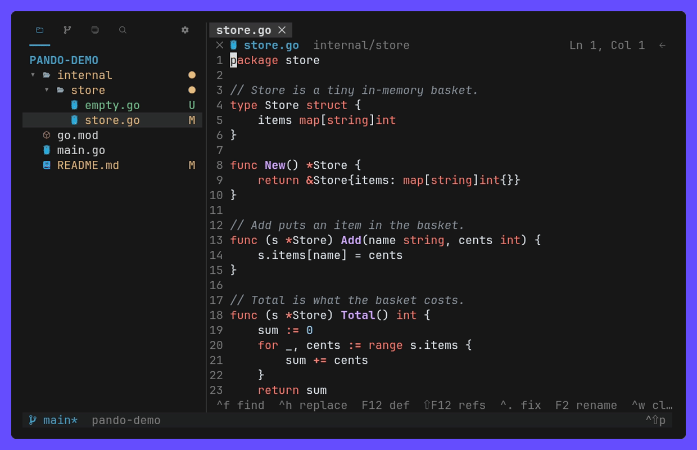
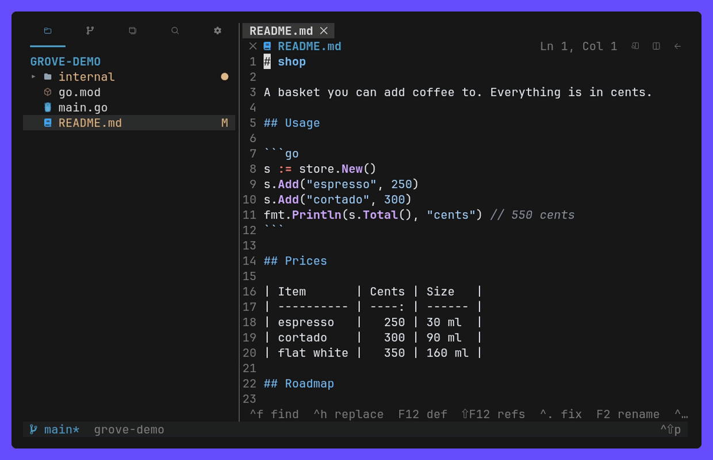
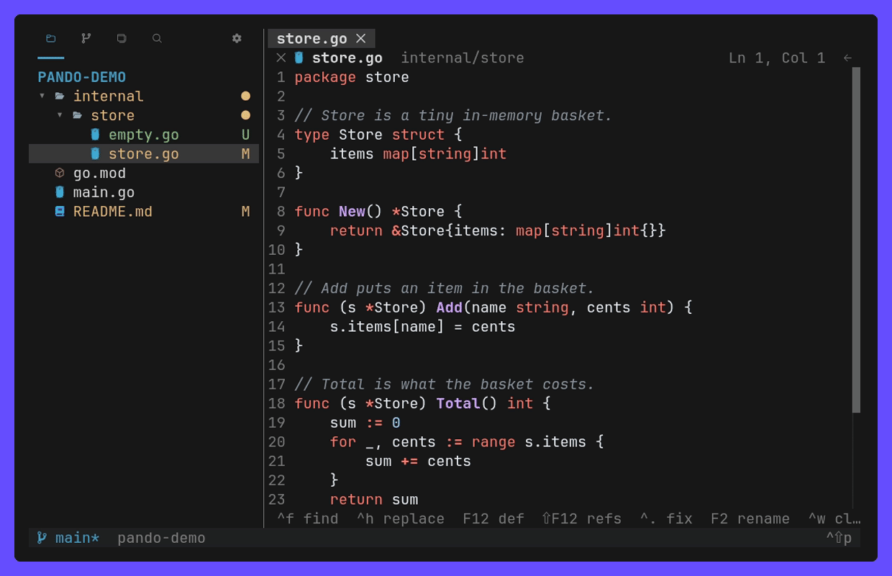

<h1 align="center">
    pando
</h1>

<p align="center">
    A terminal workspace for AI agent sessions: run Claude, Codex or any shell
    across several projects and git worktrees at once, and review what they
    changed with VS Code's diffs, all in one TUI.
</p>


## Why

I wanted Zed's agent sessions, but across several projects at once. herdr does
that and has an API to orchestrate them, yet reviewing what the sessions
changed still meant opening another tool, and the diffs I actually like
reading are VS Code's.

So pando combines the three:

- **Zed**: sessions that run side by side over many projects, each in its own
  worktree, so parallel work never collides.
- **herdr**: a daemon that keeps them alive and a socket API that scripts and
  agents can drive.
- **VS Code**: Source Control, diffs and an editor next to the session that
  made the change, without leaving the terminal.

The name is [Pando](https://en.wikipedia.org/wiki/Pando_%28tree%29), the aspen
colony in Utah: thousands of trunks, one root system, one organism. That is the
shape here too — every session is its own stem, and one daemon underneath keeps
them all alive.

## Features

- **Agent sessions**: projects → worktrees → sessions. Sessions show as tabs
  over the terminal, are marked when they need attention, and resume their
  agent after a daemon restart.
- **Source Control**: VS Code's view with staged, unstaged and untracked
  changes, staging of selected lines, Commit & Sync, AI commit messages and
  history drawers.
- **Diffs**: inline or side by side, word-level highlights, and stepping
  through a file's revisions like GitLens.
- **Editor**: undo, find, suggestions, format on save, and language servers
  for definition, references, rename and code actions.
- **Explorer and Search**: a tree with git decorations, quick open, and
  workspace search & replace.
- **Terminal panel**: under the editor like VS Code's, maximized or moved to a
  sidebar.
- **Layout**: drag views between sidebars and columns. VS Code's 2026 themes,
  Nerd Font, emoji or ASCII icons, remappable keys.
- **CLI and API**: everything the TUI does is JSON over a unix socket.
- **Self-update**: a new release shows in the status bar; one click downloads
  and verifies it, and pando runs it after a restart.
- Linux and macOS

## Install

```sh
curl -fsSL https://raw.githubusercontent.com/xseman/pando/master/install.sh | sh
```

The script downloads the release binary for this platform, checks it against
the release's `CHECKSUMS.txt` and puts it in `~/.local/bin`. `PANDO_VERSION`
pins a release, `PANDO_INSTALL_DIR` changes where it lands.

From source instead:

```sh
make install     # go build, then installs to ~/.local/bin/pando
```

Then:

```sh
pando            # TUI in the project opened last (starts the daemon if needed);
                 # the first run, with none to reopen, opens the current directory
pando ~/code/app # add a directory to the projects and open it
```

pando needs git; building it needs Go 1.26. Optional:

- a [Nerd Font](https://www.nerdfonts.com/) for the icons (without one pando
  falls back to `icons = "emoji"`, herdr-sidebar's set; `"ascii"` is plain text)
- `rg` for search
- language servers such as `gopls` and `typescript-language-server`
- the `claude` CLI for commit messages

## How it works

```
pando (TUI) ──┐
pando (CLI) ──┼── unix socket, JSON ──▶ daemon ──▶ sessions (PTY) in git worktrees
agents      ──┘                           │
                                          └──▶ config.toml, state.json
```

One daemon keeps the sessions alive. The TUI and the CLI are clients of the
same API, and every attached TUI follows a switch made anywhere. Sessions get
`PANDO_SESSION` and `PANDO_RUNTIME_DIR`, so an agent inside one can drive pando
too.

## Usage

### Agent sessions

The Spaces view is a tree of projects → worktrees → sessions. `n`, or the `+`
on the session tab strip, opens a shell in the workspace right away; start
`claude`, `codex` or anything else inside it. _New Agent Session…_ runs an
`[agents]` preset directly.

- Open sessions are tabs over the terminal: click to switch, middle click (or
  the `✕`) to kill, right click to rename (`R` in Spaces does it too).
- A session opens in a column of its own right of the editor, so a file opens
  beside it. Drag it by its title (the row under its tabs, or the frame's
  title) to the other side, or into the middle of the editor to give it the
  whole editor area; widening its column nearly over the editor does that too.
  Opening a file docks it back on the side it came from, and moving Spaces to
  the other sidebar takes the session column along. `session_position`
  (`right`, `left`, `editor`) is where a session opens next time.
- A second click on the shown session in Spaces, or _Close (keeps running)_
  from its title's right click, takes it off the screen; it runs on.
- A tab names what runs in it: `claude` started in a shell names it, by the
  task Claude Code puts in the terminal title. A renamed tab keeps its name,
  across daemon restarts too; an empty name goes back to the automatic one.
- A checkout inside a worktree renames its branch in the tree, the tabs and
  the session header within a tick.
- Switching a session re-roots Files and Source Control to its worktree.
- The project name in the status bar, next to the branch, lists every project
  to switch to, and adds one. _Add project_ completes the directory as fish
  does: the rest shows dimmed, `tab` or `→` takes it. Whatever switches the
  workspace selects its row in the Spaces tree, as a click on it would.
- Drag a project row up or down to reorder the list; the order is saved and
  the project switcher follows it. `alt+↑↓` moves the selected one instead.
- An unfolded project is followed by a blank row, herdr's gap between two
  spaces; folded ones stack without it. The selection and clicks pass over it.
- Sessions hang off their branch with herdr's symbols: `×` waits for a
  permission or an answer, `◐` works, `✓` finished while nobody was looking (or
  rang the bell), `○` idles. The project row shows its most demanding session.
- A session out of view plays a sound when it starts waiting or finishes
  (`sounds`, `sound_done`, `sound_request` in the config).
- A session whose process exits with code 0 closes; a failed one stays listed
  with its exit code.


When the daemon restarts, every session comes back as its shell _and_
continues the agent that was running in it. pando watches which program holds
the terminal and types the `[resume]` command for it. `claude --continue`,
`codex resume --last` and `opencode --continue` work out of the box; any other
agent is one line:

```toml
[resume]
aider = ["aider", "--restore-chat-history"]
```


### Source Control and diffs

Source Control follows VS Code:

- Merge Changes, Staged Changes, Changes and Untracked Changes, as a list or
  a tree, with hover `+` / `−` / `↶` buttons on sections, folders and files.
- Merge Changes lists the conflicts of a merge, rebase or cherry-pick, each
  with its kind (both modified, deleted by them, …). A click opens the file,
  `⏎` or `+` marks it resolved; a file that still holds `<<<<<<<` markers, or
  a deletion conflict, asks first. The Commit button waits as _Continue_ until
  the section is empty, then finishes the operation; the branch shows `!`
  meanwhile.
- A message box per repository, and Commit (Commit & Sync and Amend in the `∨`
  menu). Both stay on top while the changes scroll, with the header of the
  section under them, like VS Code's sticky scroll.
- Once nothing is left to commit the button turns into _Publish Branch_ (no
  upstream yet) or _Sync Changes 1↓ 2↑_ (ahead or behind), as VS Code's action
  button does; with nothing to do either it stays a muted Commit.
- Publish Branch pushes to the only remote, lets you pick one (or add one)
  when there are several, and with none creates a private or public GitHub
  repository through `gh` and pushes there, like VS Code's Publish to GitHub.
- ✧ writes a commit message with the local `claude` CLI.
- History drawers: graph, commits, file history, branches, worktrees, remotes,
  stashes and tags. They sit at the bottom: click a header to open one, drag an
  open header to resize it.

Diffs show old and new line numbers, row tints and word-level highlights,
inline or side by side (when the main area has 90 columns). Selected lines can
be staged, unstaged or reverted from either view.


### Editor

An open file is an editor. A file changed on disk under you is not overwritten
without a word, and closing with unsaved text asks first. These stay read-only:

- diffs, revisions and rendered Markdown
- files over 1 MiB or 5 000 lines (`e` in the menu still sends them to
  `$EDITOR`)

Move the cursor onto a name the file uses and every occurrence of it is
highlighted; a name being typed, or one used only once, is left alone.

**New files.** `ctrl+n`, or a double click on the empty editor area, opens an
untitled buffer to type into; `ctrl+s` asks where it goes, completing the path
as fish does. Nothing unsaved is ever lost: an untitled buffer and an unsaved
edit to a file alike are kept as drafts in `~/.local/share/pando/drafts/`, so
reopening pando brings the tab back with its text, its `●` and its cursor — and
a file someone else wrote in the meantime still asks before it is overwritten.
A draft goes when you save it, or when you close the tab and say so.

**Merge conflicts.** A file with `<<<<<<<` / `=======` / `>>>>>>>` blocks gets
VS Code's merge-conflict treatment whether or not git still lists it as
unmerged: the current and incoming sides are tinted, the `<<<<<<<` line reads
_Accept Current Change | Accept Incoming Change | Accept Both Changes_ and a
click on one resolves that block. The menu and the palette add _Accept All
Current / Incoming / Both_ and _Next / Previous Conflict_; one `ctrl+z` takes
an accept back.



**Vim mode.** `vim_mode = true` (or _Preferences: Vim Mode_) opens every editor
in normal mode: `hjkl 0 $ w b e gg G` with counts, `i a I A o O` to insert,
`d c y` over a motion or doubled (`dd yy cw d$`), `x D C J p P u` and `ctrl+r`,
`v` and `V` to select. The mode sits in the header beside `Ln, Col`, the cursor
is a block in normal mode and a bar while inserting. It is a key layer, not a
second editor: `/` opens pando's find widget, `:` its go-to-line picker, and in
insert mode typing, suggestions, `ctrl+s` and every other key are what they are
with the setting off. No ex commands — `:w` is `ctrl+s`, `:q` is `ctrl+w` — and
no macros, marks or text objects.


**Suggestions.** Typing in code opens VS Code's suggest list under the cursor.
It shows the file's own words at once, the language server's completions when
it answers, and member lists after a `.`. `ctrl+space` opens it anywhere,
Markdown and plain text included. In an editor `ctrl+space` belongs to the
suggestions, so the terminal is on `ctrl+j` there (and on ``ctrl+` `` in
terminals with the kitty keyboard protocol).

**Formatting.** `ctrl+shift+i` formats the document, and `ctrl+s` formats
before it writes while `format_on_save` is on. The formatter is whatever you
name in `config.toml`, keyed by file extension or LSP language id:

- The file goes in on stdin and comes back formatted on stdout, the one
  interface every formatter already has.
- `$FILE` in an argument becomes the file's path.
- Go works out of the box through `gofmt`.

```toml
format_on_save = true

[format]
ts = ["prettier", "--stdin-filepath", "$FILE"]  # by extension
python = ["black", "-q", "-"]                   # by language id
rs = ["rustfmt", "--emit", "stdout"]
zig = ["zig", "fmt", "--stdin"]
```

A formatter that fails changes nothing. The first line of its error goes to
the status bar, and a save still writes the file unformatted, as VS Code does.
One `ctrl+z` takes a formatting back.

**Markdown.** `ctrl+shift+v` renders a Markdown file, and `alt+v` shows the
rendered file beside the source. `ctrl+shift+o` lists its headings, no
language server needed.



### Language servers

| Key               | Action                                                                            |
| ----------------- | --------------------------------------------------------------------------------- |
| `F12`             | go to definition                                                                  |
| `shift+F12`       | list references in a peek under the editor                                        |
| `ctrl+.`, `alt+⏎` | code actions for the selection, grouped as VS Code groups them, applied to files  |
| `F2`              | rename the symbol under the cursor across the workspace, in a box over the symbol |
| `ctrl+shift+o`    | go to a symbol in the file; `@:` groups them by kind, as VS Code does             |
| typing, `.`       | completions in the suggest list                                                   |

Go and TypeScript/JavaScript work as soon as their server is on `PATH`
(`gopls`, `typescript-language-server`). Any other language is one line in
`config.toml`, keyed by file extension or LSP language id:

```toml
[lsp]
zig = ["zls"]                                  # every .zig file
python = ["pyright-langserver", "--stdio"]     # by language id
rs = ["rust-analyzer"]                         # by extension
lua = ["lua-language-server"]
```


pando starts the server on the first request in a matching file, one per
language and workspace, and stops it with the TUI.

- It installs nothing: a missing binary just says so.
- A project's own copy wins: the nearest `node_modules/.bin/<command>` above
  the file is used before `PATH`, so `typescript-language-server` (or
  `prettier` in `[format]`) matches the project's version, per package in a
  monorepo.
- TypeScript 7 needs nothing more: its own `tsc --lsp` answers when the
  nearest `node_modules/typescript` is 7, which `typescript-language-server`
  cannot drive. Older versions still need `typescript-language-server`.
- `typescript-language-server` is told where the nearest
  `node_modules/typescript` is, so a package deeper than the workspace root
  works too, each with its own TypeScript version.
- `ctrl+.` has no legacy encoding and needs the kitty keyboard protocol. Other
  terminals can use `alt+⏎`, or plain `.` in a read-only file.
- A server rewrites files on disk, so an editor with unsaved text is saved
  first. A code action has no undo of its own; git is the undo.
- There are no diagnostics. Formatting goes through `[format]`, so a language
  needs no server to be formatted.

### Terminal panel

``ctrl+` ``, `ctrl+j` or `5` opens a shell panel under the editor, VS Code's
own spot, and the same key closes it.

- `ctrl+shift+↑` gives it the whole editor area; `ctrl+shift+↓` hands it back.
- Drag its title row, past the tabs, to make it taller or shorter; the height
  is kept.
- Right click it for Copy All, Paste, Clear, Kill Terminal and Toggle Size to
  Content Width (`alt+z`): the shell then runs 240 columns wide and a sideways
  wheel (or `shift`+wheel) pans it, so long lines stop wrapping.
- Right click its tab, or use the command palette, to move it to the left or
  right sidebar. There it gets a column of its own and never shares one with
  another view.
- Its shells are sessions: tabs across the top, `+` for another, middle click
  or `✕` to close. They stay out of the Spaces tree.



### Layout and settings

The layout follows VS Code (via herdr-sidebar): an activity bar per sidebar,
and view headers with hover actions.

- Drag a tab along its activity bar to reorder it, or onto another sidebar's
  bar, or the half of that sidebar facing main, to make it a tab there: a small
  frame between the icons marks its slot. Drag it below the bar toward the
  screen edge to give it a column of its own, framed whole; sidebars are
  columns beside each other, as many as fit.
- Right click a tab for the same moves, and to merge it back into the
  neighboring column.
- Drag a `│` divider to resize a column.
- `activity_bar = "side"` puts the view icons down each sidebar's outer edge.

All of it is saved in `config.toml` (`left`/`right` columns).

Settings (`,`, ⚙, or `~/.config/pando/config.toml`, edits apply live):

| Setting    | Values                                                                                                           |
| ---------- | ---------------------------------------------------------------------------------------------------------------- |
| theme      | `vscode` (2026 Dark or Light by the terminal background), `vscode-dark`, `vscode-light`, `terminal` (ANSI)       |
| diff view  | `inline` or `split`                                                                                              |
| icons      | `nerd` (picked automatically when `fc-list` finds a Nerd Font), `emoji` (herdr-sidebar's set, any font), `ascii` |
| `[colors]` | single colors, keyed by the palette names `pando doctor` prints                                                  |
| `[keys]`   | remapped keys, by the command ids `pando doctor` prints                                                          |

`pando doctor` also lists every icon with the font that draws it.

### Updates

The daemon asks GitHub once a day whether a newer pando was released. When one
is, its version shows in the right corner of the status bar:

```
 ⎇ main* ↑1  repo                              ! 1  12 results  ^⇧p  ↑ v0.3.0
                                                                    └ click it
 ⎇ main* ↑1  repo                              ! 1  12 results  ^⇧p  ↓ ████░░ 43%
 ⎇ main* ↑1  repo                              ! 1  12 results  ^⇧p  ⟳ restart to update
```

Clicking it downloads the release binary, checks it against the release's
`CHECKSUMS.txt` and puts it where this pando is installed. Nothing is replaced
that the checksums do not cover, and the running process keeps the binary it
started from: the new one runs after a restart.

`pando update` does the same from the shell, and `update_check = false` in
`config.toml` turns the daily check off — `pando update` still works.

## Keys

| Key                                                         | Action                                                                                       |
| ----------------------------------------------------------- | -------------------------------------------------------------------------------------------- |
| `ctrl+]`                                                    | cycle focus: left sidebar, main, right sidebar. In a session every other key goes to the app |
| `1`–`4`                                                     | Files, Git, Spaces, Search                                                                   |
| `ctrl+shift+e` `ctrl+shift+g` `ctrl+shift+f` `ctrl+shift+h` | Explorer, Source Control, Search, Search with replace                                        |
| `ctrl+j`, `5`, ``ctrl+` ``                                  | toggle the terminal panel (a terminal sends the same byte for ``ctrl+` `` and `ctrl+space`)  |
| ``ctrl+shift+` ``                                           | another shell in the terminal panel                                                          |
| `ctrl+shift+↑` `ctrl+shift+↓`                               | maximize the terminal panel, and restore it                                                  |
| `ctrl+shift+p`, `F1`                                        | command palette: every command available now, each one bindable in `[keys]`                  |
| `ctrl+p`                                                    | quick open (`ctrl+t` or the title button switches list and tree)                             |
| `alt+t`                                                     | go to an agent session or worktree (`@idle`, `@running`, `!claude` narrow it)                |
| `[` `]`                                                     | previous / next session                                                                      |
| `ctrl+n`                                                    | new untitled file (a double click on the empty editor area does the same)                    |
| `ctrl+tab`, `ctrl+w`                                        | next editor, close editor (middle click closes a tab too); a workspace reopens its editors   |
| `ctrl+pgup` `ctrl+pgdn`, `alt+1`…`alt+9`                    | previous / next editor, editor N                                                             |
| `ctrl+←` `ctrl+→`, `alt+,` `alt+.`                          | back and forward through visited editors (also `super+←` `super+→`)                          |
| `ctrl+0` `ctrl+1`                                           | focus sidebar / editor                                                                       |
| `ctrl+f`                                                    | in a panel: filter the list (`enter` keeps it, `esc` clears); in a file: find                |
| `ctrl+b`, `b`, `<` `>`                                      | fold the sidebars to a rail of view icons (click one or `»` to reopen), resize a column      |
| `ctrl+,`, `?`                                               | settings, help (`,` in a sidebar too)                                                        |
| `m`, right click                                            | context menu                                                                                 |
| `q`, `esc`                                                  | close the TUI once there is nothing left to close; it asks first (sessions keep running)     |

| View   | Keys                                                                                                                                                                                                                                |
| ------ | ----------------------------------------------------------------------------------------------------------------------------------------------------------------------------------------------------------------------------------- |
| Files  | `⏎` open, `h`/`l` fold, `n`/`N` new file/folder, `R` rename, `D` delete, `s` stage, `e` edit, `y`/`Y` copy path, `.` hidden files, `C` collapse all                                                                                 |
| Git    | `⏎` stage/unstage, `o` diff, `t` tree or list, `a`/`u` stage/unstage all, `U` stage untracked, `d` discard, `c` message, `C` commit, `A` suggest, `S` sync or publish, `O` open file, `B` switch branch or tag, `{` `}` switch repo |
| Spaces | `⏎` switch, `M-↑↓` move a project, `n` new shell session, `w` new worktree, `a` add project, `x` kill/remove                                                                                                                        |

| In a file                         | Action                                                                    |
| --------------------------------- | ------------------------------------------------------------------------- |
| arrows, `shift`+arrows, drag      | move the cursor, select                                                   |
| `ctrl+↑` `ctrl+↓`                 | scroll the view, the cursor stays where it is (the wheel does the same)   |
| `ctrl+a`, `ctrl+c`                | select all, copy the selection (or the whole file)                        |
| `ctrl+z` `ctrl+y`, `ctrl+s`       | undo, redo, save (`●` until you do; an untitled file asks where)          |
| `⏎`, `tab`, `⌫`, `del`            | typing; `⏎` keeps the indent                                              |
| `ctrl+x`, `ctrl+shift+k`          | cut, delete the line or selection                                         |
| `alt+shift+↑↓`, `ctrl+d`          | copy the line or the selected lines up, down                              |
| `alt+↑` `alt+↓`                   | move the line                                                             |
| `alt+shift+→←` (`ctrl+shift` too) | expand, shrink the selection: word, line, brackets, file                  |
| `ctrl+/`                          | toggle a comment                                                          |
| `ctrl+space`                      | suggestions                                                               |
| `ctrl+shift+i`                    | format document                                                           |
| `ctrl+f`, `⏎`/`F3`, `shift+F3`    | find widget, next, previous (`alt+c` `alt+w` `alt+r` case/word/regex)     |
| `ctrl+h`, `⏎`, `ctrl+alt+⏎`       | replace box (`tab` switches fields), replace and go on, replace all       |
| `alt+p`                           | preserve case while replacing                                             |
| `ctrl+g`                          | go to line: the `:` picker, also `:` typed first in `ctrl+p`              |
| `ctrl+shift+o`                    | go to symbol; `@:` groups them by kind, `@` in `ctrl+p` does the same     |
| `alt+z`                           | wrap                                                                      |
| `s`                               | diff inline or side by side                                               |
| `shift+F10`, right click          | Stage / Unstage / Revert Selected Ranges in a diff (`m` outside a file)   |
| `ctrl+⏎`                          | commit                                                                    |
| `O`, header button                | open the file a diff shows, at the line under the cursor                  |
| `←` `→` header buttons, `H`       | step through the file's revisions, pick one                               |
| `ctrl+shift+v`, `alt+v`           | rendered Markdown, beside the source                                      |
| `e`                               | open in `$EDITOR`                                                         |
| `esc`, `q`                        | clear the selection, close                                                |
| vim mode                          | `vim_mode = true`: the editor opens in normal mode, `i` types, `esc` back |

A tilt wheel or `shift`+wheel scrolls sideways; the plain wheel scrolls a
session's scrollback when the app does not use the mouse.

## CLI

Every command talks to the daemon and prints JSON.

```
pando ~/code/app                                     # add a project and open the TUI in it
pando session new --agent claude --ws ../repo-feat --name fix --wait
pando session new --ws . -- npm run dev              # any command
pando session ls | pando session get fix             # ID, its name, or a prefix of either
pando session send fix 'fix the failing test' --wait --timeout 180000
pando session wait fix --until blocked --timeout 60000
pando session keys fix esc                           # named keys: esc ctrl+c shift+tab …
pando session read fix --lines 120
pando session switch fix                             # every attached TUI follows
pando ws new feat-x --project .                      # git worktree under ~/.local/share/pando
pando ws ls | pando ws rm PATH
pando project move ~/code/app 0                      # first in the Spaces list
pando open README.md                                 # preview in attached TUIs
pando set width 40
pando set diff_view split
pando version                                        # the release this binary was built from
pando update                                         # install the latest release over it
pando call draft.list '{"ws":"."}'                   # unsaved editor text
pando call METHOD '{"json":"params"}'                # raw API
pando stop
```

Agents: `--agent claude codex gemini opencode shell`. `session new --wait` and
`session send --wait` block until the session is idle, blocked or exited, so
nothing has to poll; `session ls` reports that status per session.

The API covers sessions, workspaces, projects and settings. Explorer, Source
Control, Search and the editor are TUI surfaces over git and the filesystem —
a script uses git for those.

`pando skill` prints [skills/pando/SKILL.md](skills/pando/SKILL.md), the guide
for an agent driving pando: states, waits, naming and the safety rules.


## Files

| Path                                | Content                                                              |
| ----------------------------------- | -------------------------------------------------------------------- |
| `$XDG_RUNTIME_DIR/pando/pando.sock` | API socket, `daemon.log`                                             |
| `~/.config/pando/config.toml`       | settings and agent presets, documented in the file; edits apply live |
| `~/.config/pando/state.json`        | projects, commit drafts, open editors, session specs                 |
| `~/.local/share/pando/worktrees/`   | worktrees created by pando                                           |
| `~/.local/share/pando/drafts/`      | unsaved editor text, per workspace                                   |

`PANDO_RUNTIME_DIR`, `PANDO_CONFIG_DIR` and `PANDO_DATA_DIR` override them.
Sessions are respawned in their worktree when the daemon restarts; their
scrollback is not.

## Docs

| Doc                                        | Contents                                                     |
| ------------------------------------------ | ------------------------------------------------------------ |
| [01 Architecture](docs/01-architecture.md) | daemon, socket protocol, sessions, packages                  |
| [02 UI layout](docs/02-ui-layout.md)       | columns, rows, mouse geometry, modals                        |
| [03 Views](docs/03-views.md)               | Explorer, Source Control, Spaces, Search, commands           |
| [04 Preview](docs/04-preview.md)           | diffs, editor, Markdown, find, LSP, staging lines, revisions |
| [05 Git](docs/05-git.md)                   | status, worktrees, branches, writing to the index            |
| [06 Config](docs/06-config.md)             | config.toml, state.json, settings, colors                    |
| [07 Testing](docs/07-testing.md)           | test layers and interactive checks                           |
| [08 Release](docs/08-release.md)           | release-please, artifacts, install script, self-update       |

## Development

```
make test                    # go vet + go test -race ./...
make lint                    # golangci-lint, config in .golangci.yml
make fmt                     # gofumpt -w .
go test -short ./...         # skip the end-to-end TUI test
make demo                    # re-record every GIF in docs/demo
```

CI runs `make test` and `make lint` on every push and pull request.

The tests cover units, the daemon API over a real socket, and the TUI in a
PTY.

Every recording comes from `docs/demo/*.tape`, replayed with
[VHS](https://github.com/charmbracelet/vhs) against a throwaway repository in
`/tmp/pando-demo`.

- **Tools:** `vhs`, `ttyd`, `ffmpeg`, a Chrome, `jq` (CLI tape), `gopls` (LSP
  tape) and `claude` (tui, sessions, projects and panels tapes, which run real
  sessions).
- **Shared parts:** every tape sources `settings.tape` (terminal size and font)
  and `setup.tape` (hidden: fresh state and repository, and `cfg.sh`, which
  writes `config.toml` so a tape names only its width, its key bindings and
  the agent preset it needs); `diff.tape` adds `merge.sh`, a branch whose
  `main.go` conflicts with main's. Topic tapes open
  pando while hidden, so each GIF starts on its subject; waits on claude and
  gopls use `Wait+Screen` instead of fixed sleeps.
- **VHS version:** use v0.10 or v0.11. v0.12 records but never writes the GIF
  ([vhs#787](https://github.com/charmbracelet/vhs/issues/787)).
- **Font and icons:** the tapes record with `icons = "nerd"` and
  `Set FontFamily "JetBrainsMono Nerd Font Mono"`.
- **Theme:** `settings.tape` paints the terminal (`Set Theme`) and the frame
  around it (`Set Margin`, `MarginFill`, `BorderRadius`); `mode` in `cfg.sh`
  paints pando (`color_theme`) and the claude session inside it. The GIFs
  record dark, which is vhs's own default; each file carries the light line
  next to it, commented — swap them together.
- **Keys:** VHS cannot send `F12`, `ctrl+.`, `ctrl+s`, `ctrl+space` or
  `alt+shift` chords, so tapes bind those commands to `ctrl` letters in their
  own `config.toml` (`cfg 26 ctrl+k=editor.saveFile`); `shift+↓` is typed as
  its raw escape sequence.
- **Focus:** a `[keys]` binding never fires inside a session, so a tape that
  leaves the focus there hands every following key to the agent instead — and
  records a GIF of the agent being typed at. Only move the focus with `ctrl+]`
  when the tape means to, and check where it lands.
