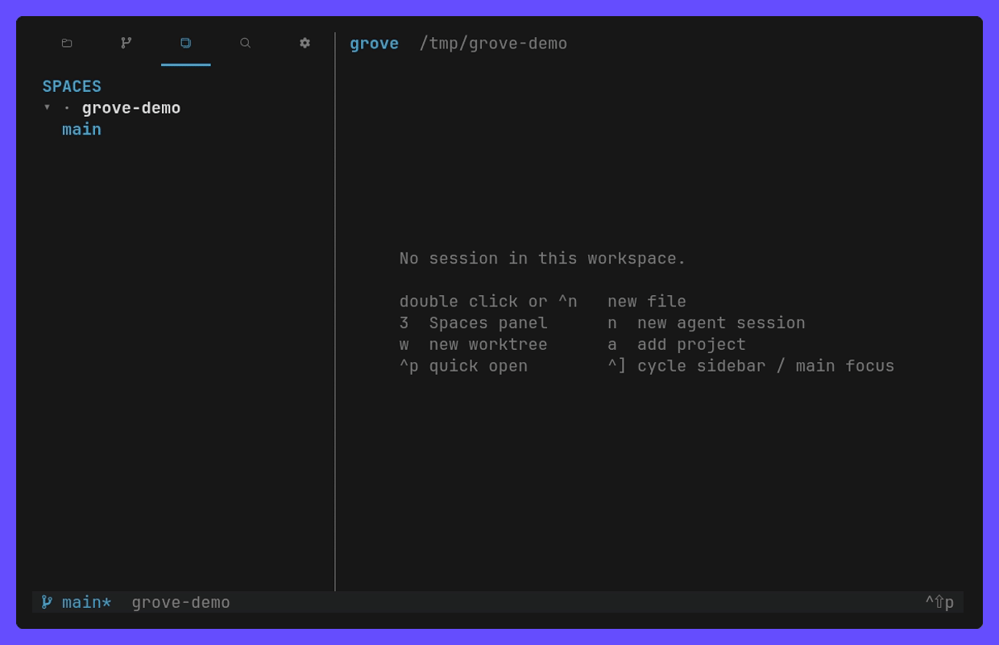
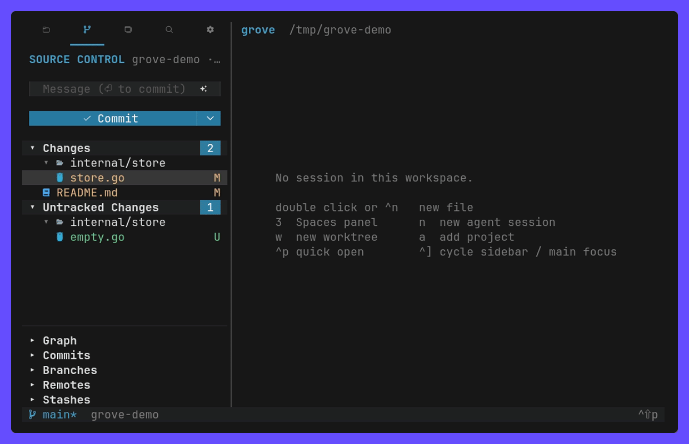
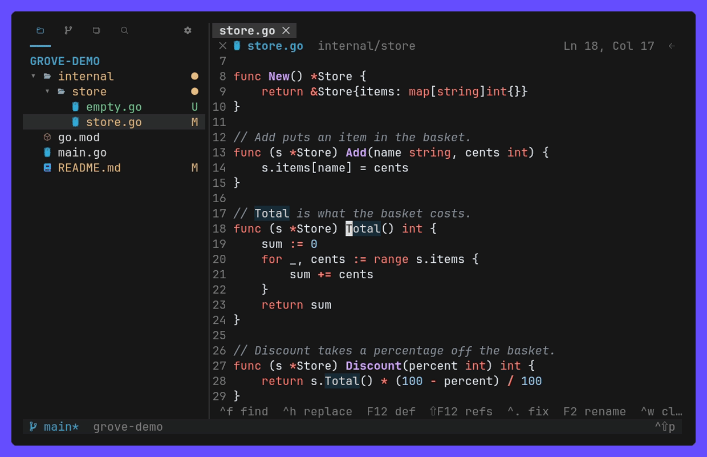
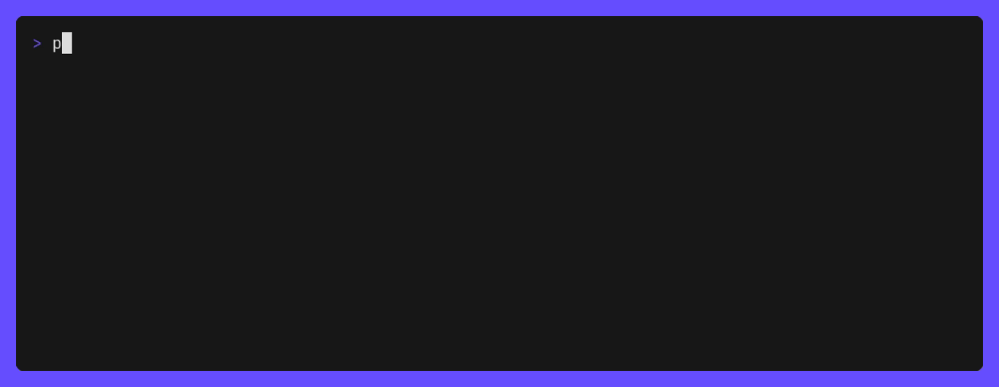

<h1 align="center">
    🌳 pando
</h1>

<p align="center">
    A terminal workspace for AI agent sessions: run Claude, Codex or any shell
    across several projects and git worktrees at once, and review what they
    changed with VS Code's diffs, all in one TUI.
</p>


## Why

I wanted Zed's agent sessions, but across several projects at once. herdr does
that and has an API to orchestrate them — yet reviewing what the sessions
changed still meant opening another tool, and the diffs I like reading are VS
Code's. pando combines the three:

- **Zed**: sessions side by side over many projects, each in its own worktree.
- **herdr**: a daemon that keeps them alive, and a socket API to drive them.
- **VS Code**: Source Control, diffs and an editor next to the session that
  made the change.

The name is [Pando](https://en.wikipedia.org/wiki/Pando_%28tree%29), the aspen
colony in Utah: thousands of trunks, one root system, one organism. Every
session is its own stem, and one daemon underneath keeps them all alive.

## Features

- **Agent sessions**: projects → worktrees → sessions, as tabs over the
  terminal, marked when they need you, resumed after a daemon restart.
- **Source Control**: VS Code's view — staged, unstaged and untracked changes,
  line-level staging, Commit & Sync, AI commit messages, history drawers.
- **Diffs**: inline or side by side, word-level highlights, and stepping
  through a file's revisions like GitLens.
- **Editor**: undo, find, suggestions, format on save, vim mode, and language
  servers for definition, references, rename and code actions.
- **Explorer and Search**: a tree with git decorations and VS Code's context
  menu (new, duplicate, rename, delete, copy path, find in folder), quick
  open, and workspace search & replace.
- **Layout**: a terminal panel, draggable views and columns, VS Code's 2026
  themes, Nerd Font / emoji / ASCII icons, remappable keys.
- **CLI and API**: everything the TUI does is JSON over a unix socket.
- **Self-update**, on Linux and macOS.

## Install

```sh
curl -fsSL https://raw.githubusercontent.com/xseman/pando/master/install.sh | sh
```

The script verifies the release binary against `CHECKSUMS.txt` and puts it in
`~/.local/bin`. `PANDO_VERSION` pins a release, `PANDO_INSTALL_DIR` changes
where it lands. From source: `make install` (needs Go 1.26).

```sh
pando            # the project opened last, or the current directory
pando ~/code/app # add a directory to the projects and open it
```

pando needs git. Optional: a [Nerd Font](https://www.nerdfonts.com/) for the
icons (without one it falls back to emoji, or `icons = "ascii"`), `rg` for
search, language servers such as `gopls`, and the `claude` CLI for commit
messages.

## How it works

```
pando (TUI) ──┐
pando (CLI) ──┼── unix socket, JSON ──▶ daemon ──▶ sessions (PTY) in git worktrees
agents      ──┘                           │
                                          └──▶ config.toml, state.json
```

One daemon keeps the sessions alive; the TUI and the CLI are clients of the
same API, so every attached TUI follows a switch made anywhere. Sessions get
`PANDO_SESSION` and `PANDO_RUNTIME_DIR`, so an agent inside one can drive
pando too.

## Usage

### Agent sessions

Spaces is a tree of projects → worktrees → sessions. `n`, or `+` on the tab
strip, opens a shell in the workspace; start `claude`, `codex` or anything
else inside it.

- `⌂` marks a project's own checkout, `⑂` its linked worktrees. `x` deletes a
  worktree (folder only, the branch stays) but only closes a project: its
  checkout is never removed.
- Every session has tabs of its own, as a herdr workspace does: `+` on the
  strip over the terminal opens another shell in it, `[` `]` cycle them,
  middle click kills one, right click renames it. The Spaces tree lists the
  sessions, each showing its busiest tab's state; drag a session (or `alt+↑↓`)
  to reorder it under its worktree, or a worktree, sessions and all, under its
  project. A session opens in a column of its own beside the
  editor — drag it to the other side or over the editor area.
- Symbols follow herdr's: `×` waits for you, `◐` works, `✓` finished unseen,
  `○` idles. A session out of view can play a sound, and one that waits,
  finished unseen or failed is tinted in its symbol's color and pulses until
  you click it (`session_highlight = "tint"`, `"steady"` or `"off"`).
- Drag over a session to select text; letting go copies it.
- Switching a session re-roots Files and Source Control to its worktree.
- The header's view options (`o`) are VS Code's: _Filter_ by state, _Sort
  by Created / Updated_, _Group by Workspace / Time_ (Today, Yesterday, Last
  7 Days, …), _Collapse All Groups_.
- The project name in the status bar switches projects and adds them.



When the daemon restarts, every session comes back as its shell _and_
continues the agent that was in it: pando watches which program holds the
terminal and types the `[resume]` command. `claude --continue`, `codex resume
--last` and `opencode --continue` work out of the box; anything else is one
line:

```toml
[resume]
aider = ["aider", "--restore-chat-history"]
```

Claude sessions come back with their own conversation, by id, not the latest
in the directory, and a conversation that is still open elsewhere is not opened
twice: the session stays a shell and says where it is. A session attached to a
Claude background job (`claude attach`) attaches to it again while it runs, and
a claude started as `CLAUDE_CONFIG_DIR=… claude` comes back in that config.

### Source Control and diffs

Source Control follows VS Code: Merge / Staged / Changes / Untracked sections
as a list or tree, hover actions, a message box with sticky scroll, and
history drawers (graph, commits, file history, branches, worktrees, remotes,
stashes, tags).

- The button is VS Code's: Commit, then _Publish Branch_ or _Sync Changes_,
  and _Continue_ while a merge, rebase or cherry-pick is unfinished.
- Publish pushes to the only remote, asks which one when there are several,
  and with none creates a GitHub repository through `gh`.
- The message box grows to 10 lines: `shift+⏎` (or `alt+⏎`) starts a new
  line, `⏎` commits. `ctrl+a`, shift+arrows and mouse drags select, as in
  the editor.
- The message box's ∨ has `claude` write the message: a subject (also `A`),
  one with a description, one in the repository's style, a rewrite of what
  is in the box, or another take on the last one. The box scrambles ASCII
  noise into "Generating commit message" until it lands.
- Diffs show old and new line numbers, row tints and word-level highlights,
  inline or side by side. Selected lines can be staged, unstaged or reverted
  from either view.



### Editor

An open file is an editor: undo, find and replace, go to line and go to
symbol. A file changed on disk is never overwritten silently, and closing with
unsaved text asks first. Diffs, revisions and rendered Markdown stay
read-only.

Nothing unsaved is lost: untitled buffers and unsaved edits alike are kept as
drafts in `~/.local/share/pando/drafts/`, so reopening pando brings the tab
back with its text and its cursor.

- **Merge conflicts** get VS Code's treatment whether or not git still lists
  the file as unmerged: tinted sides and _Accept Current / Incoming / Both_ on
  the `<<<<<<<` line.
- **Suggestions** open as you type in code — the file's own words at once, the
  language server's completions when it answers. `ctrl+space` forces them.
- **Markdown**: `ctrl+shift+v` renders a file, `alt+v` shows it beside the
  source.
- **Word wrap** is off: a long line scrolls sideways under a horizontal
  scrollbar. `word_wrap = true`, Settings (`ctrl+,`), `alt+z` or the header's
  wrap toggle wraps every editor.
- **Vim mode** (`vim_mode = true`) opens every editor in normal mode: motions
  with counts, `d c y` over a motion, visual mode. It is a key layer, not a
  second editor — no ex commands, macros or text objects.

**Formatting.** `ctrl+shift+i` formats, and `ctrl+s` formats first while
`format_on_save` is on. The file goes in on stdin and comes back on stdout;
Go works out of the box through `gofmt`.

```toml
format_on_save = true

[format]
ts = ["prettier", "--stdin-filepath", "$FILE"]  # by extension
python = ["black", "-q", "-"]                   # by language id
```

### Language servers

`F12` definition, `shift+F12` references in a peek, `ctrl+.` (or `alt+⏎`) code
actions, `F2` rename across the workspace, `ctrl+shift+o` go to symbol, and
completions in the suggest list.

Go and TypeScript/JavaScript work as soon as `gopls` or
`typescript-language-server` is on `PATH`; anything else is one line:

```toml
[lsp]
zig = ["zls"]                                  # by extension
python = ["pyright-langserver", "--stdio"]     # by language id
```

A project's own `node_modules/.bin` wins over `PATH`, so each package in a
monorepo gets its own server. pando installs nothing, and there are no
diagnostics — formatting goes through `[format]`.



### Terminal, layout and settings

``ctrl+` ``, `ctrl+j` or `5` opens a shell panel under the editor (inside a
session or a shell `ctrl+j` is the app's newline, so only ``ctrl+` ``);
`ctrl+shift+↑` gives it the whole editor area. Every agent session has shell
tabs of its own in it, killed with the session; with no session in view the
panel holds the workspace's shells. They stay out of the Spaces tree, and the
panel can move to a sidebar. `pando session new --agent terminal --parent ID`
opens one from a script. Each worktree keeps the panel open or shut on its
own. `ctrl+f` over a session or a shell finds in its
scrollback, as VS Code's terminal find does: `⏎` walks up to older output.

Drag a view's tab along its activity bar to reorder it, onto another sidebar
to move it, or below the bar to give it a column of its own; drag a `│`
divider to resize. It is all saved in `config.toml`.

Settings live in `~/.config/pando/config.toml` (`,` or ⚙ in the TUI; edits
apply live):

| Setting    | Values                                                                                         |
| ---------- | ---------------------------------------------------------------------------------------------- |
| theme      | `vscode` (dark or light by the terminal background), `vscode-dark`, `vscode-light`, `terminal` |
| diff view  | `inline` or `split`                                                                            |
| icons      | `nerd` (automatic when `fc-list` finds a Nerd Font), `emoji`, `ascii`                          |
| `[colors]` | palette overrides, keyed by the names `pando doctor` prints                                    |
| `[keys]`   | remapped keys, by the command ids `pando doctor` prints                                        |

### Updates

The daemon asks GitHub once a day whether a newer pando was released; the
version then shows in the status bar and one click downloads it, verified
against `CHECKSUMS.txt`. The running process keeps its binary, so the new one
starts after a restart. `pando update` does the same from the shell, and
`update_check = false` turns the daily check off.

### More recordings

The five above are the tour; these five go deeper, one feature each:
[the editor](docs/demo/edit.gif) ·
[vim mode](docs/demo/vim.gif) ·
[Markdown](docs/demo/markdown.gif) ·
[the terminal panel and docking](docs/demo/panels.gif) ·
[projects](docs/demo/projects.gif).

## Keys

| Key                   | Action                                                    |
| --------------------- | --------------------------------------------------------- |
| `ctrl+]`              | cycle focus; in a session every other key goes to the app |
| `1`–`4`               | Files, Git, Spaces, Search                                |
| `ctrl+shift+p`, `F1`  | command palette — every command available now             |
| `ctrl+p`              | quick open (`:` go to line, `@` go to symbol)             |
| `alt+t`, `[` `]`      | go to a session, previous / next session                  |
| ``ctrl+` ``, `ctrl+j` | terminal panel                                            |
| `ctrl+f`, `ctrl+h`    | find, replace                                             |
| `m`, right click      | context menu                                              |
| `?`                   | the key list, every view's                                |

[docs/09-keys.md](docs/09-keys.md) is the full list, per view and in a file.

## CLI

Every command talks to the daemon and prints JSON.

```
pando ~/code/app                                     # add a project and open the TUI in it
pando session new --agent claude --ws ../repo-feat --name fix --wait
pando session new --ws . -- npm run dev              # any command
pando session ls | pando session get fix             # ID, its name, or a prefix of either
pando session send fix 'fix the failing test' --wait --timeout 180000
pando session wait fix --until blocked --timeout 60000
pando session keys fix esc                           # named keys: esc ctrl+c shift+tab …
pando session read fix --lines 120
pando session switch fix                             # every attached TUI follows
pando ws new feat-x --project .                      # git worktree under ~/.local/share/pando
pando ws new                                         # the same on a random worktree/<adj>-<noun>-<hex> branch
pando project move ~/code/app 0                      # first in the Spaces list
pando open README.md | pando set diff_view split
pando version | pando update | pando stop
pando call METHOD '{"json":"params"}'                # raw API
```

`--wait` blocks until the session is idle, blocked or exited, so nothing has
to poll. The API covers sessions, workspaces, projects and settings; Explorer,
Source Control, Search and the editor are TUI surfaces over git and the
filesystem, so a script uses git for those.

`pando skill` prints [skills/pando/SKILL.md](skills/pando/SKILL.md), the guide
for an agent driving pando: states, waits, naming and the safety rules.



## Files

| Path                                | Content                                                              |
| ----------------------------------- | -------------------------------------------------------------------- |
| `$XDG_RUNTIME_DIR/pando/pando.sock` | API socket, `daemon.log`                                             |
| `~/.config/pando/config.toml`       | settings and agent presets, documented in the file; edits apply live |
| `~/.config/pando/state.json`        | projects, commit drafts, open editors, session specs                 |
| `~/.local/share/pando/worktrees/`   | worktrees created by pando                                           |
| `~/.local/share/pando/drafts/`      | unsaved editor text, per workspace                                   |

`PANDO_RUNTIME_DIR`, `PANDO_CONFIG_DIR` and `PANDO_DATA_DIR` override them.
Sessions are respawned in their worktree when the daemon restarts; their
scrollback is not.

## Docs

| Doc                                        | Contents                                                     |
| ------------------------------------------ | ------------------------------------------------------------ |
| [01 Architecture](docs/01-architecture.md) | daemon, socket protocol, sessions, packages                  |
| [02 UI layout](docs/02-ui-layout.md)       | columns, rows, mouse geometry, modals                        |
| [03 Views](docs/03-views.md)               | Explorer, Source Control, Spaces, Search, commands           |
| [04 Preview](docs/04-preview.md)           | diffs, editor, Markdown, find, LSP, staging lines, revisions |
| [05 Git](docs/05-git.md)                   | status, worktrees, branches, writing to the index            |
| [06 Config](docs/06-config.md)             | config.toml, state.json, settings, colors                    |
| [07 Testing](docs/07-testing.md)           | test layers and interactive checks                           |
| [08 Release](docs/08-release.md)           | release-please, artifacts, install script, self-update       |
| [09 Keys](docs/09-keys.md)                 | every key, per view and in a file                            |

## Development

```
make test                    # go vet + go test -race ./...
make lint                    # golangci-lint, config in .golangci.yml
make fmt                     # gofumpt -w .
go test -short ./...         # skip the end-to-end TUI test
make demo                    # re-record every GIF in docs/demo
make demo-lsp                # re-record one
```

CI runs `make test` and `make lint` on every push and pull request. The tests
cover units, the daemon API over a real socket, and the TUI in a PTY; see
[docs/07-testing.md](docs/07-testing.md).

Every recording comes from `docs/demo/*.tape`, replayed with
[VHS](https://github.com/charmbracelet/vhs) against a throwaway repository in
`/tmp/pando-demo`. It needs `vhs` (v0.10 or v0.11 — v0.12 records but writes
no GIF, [vhs#787](https://github.com/charmbracelet/vhs/issues/787)), `ttyd`,
`ffmpeg`, a Chrome, `jq`, `gopls` and `claude`. Every tape sources
`settings.tape` and `setup.tape`, so a tape names only what makes it
different.

`make demo` records `PAR_TAPES` in parallel (`JOBS`, 4 by default) and
`SEQ_TAPES` one at a time. A parallel tape takes a repository and a daemon of
its own from `PANDO_DEMO_REPO` and `PANDO_DEMO_STATE`; a serial one keeps the
defaults, either because it runs claude — and every directory claude opens is
one you must trust by hand the first time, so the tapes share the single
`/tmp/pando-demo` — or because the path is on screen and `/tmp/pando-demo` is
what belongs in the GIF. Five things bite:

- VHS cannot send `F12`, `ctrl+.`, `ctrl+s`, `ctrl+space` or `alt+shift`
  chords, so tapes bind those commands to `ctrl` letters in their own
  `config.toml` (`cfg 26 ctrl+k=editor.saveFile`).
- A `[keys]` binding never fires inside a session, so a tape that leaves the
  focus there hands every following key to the agent — and records a GIF of
  the agent being typed at. `1`–`4` need a focused sidebar for the same
  reason: on main the empty editor swallows them.
- Switching a project already puts that project's session on screen, so `⏎`
  on its row in Spaces takes it off again rather than opening it.
- Keys follow the focus: an editable file types `5` and `[` rather than
  toggling the terminal or cycling tabs, so a tape reaches them from a sidebar
  (`ctrl+]` from the Terminal lands in one).
- claude records in its classic renderer: `cfg.sh` passes `"tui": "default"`,
  since a fullscreen claude (the machine's own `settings.json`) draws on the
  alternate screen and matches none of the tapes' waits.
