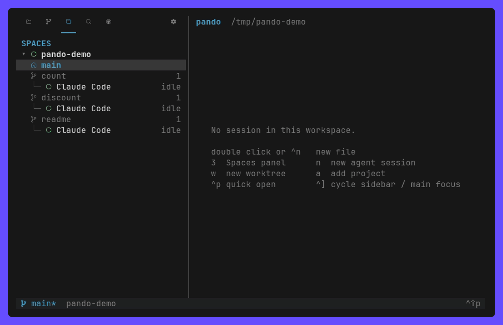
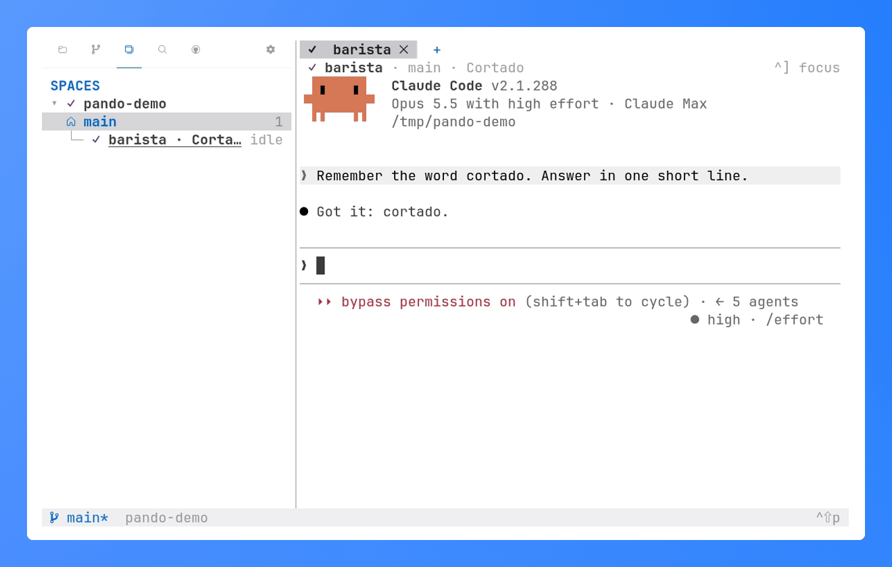
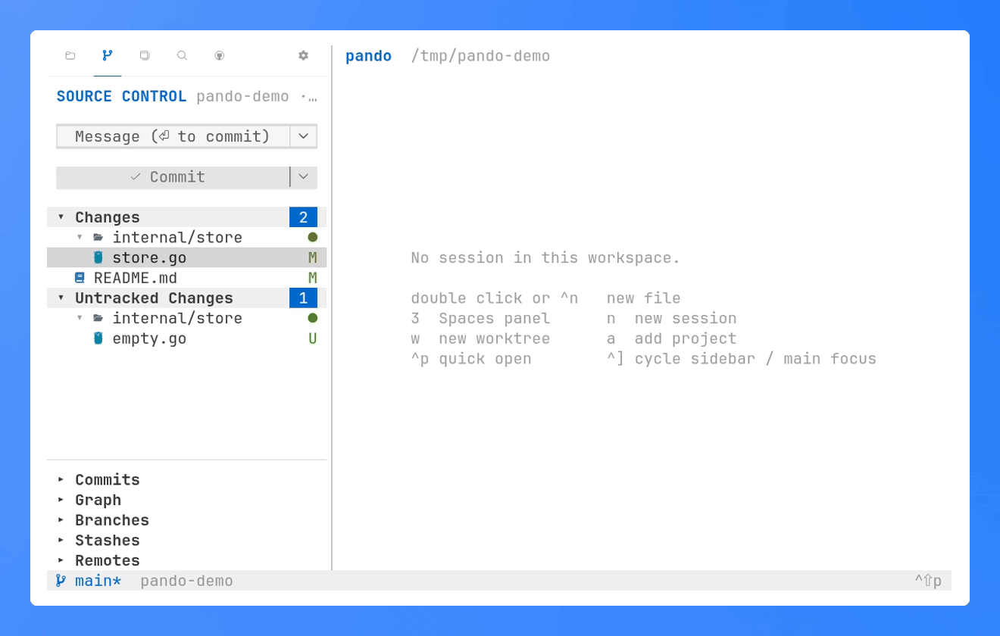
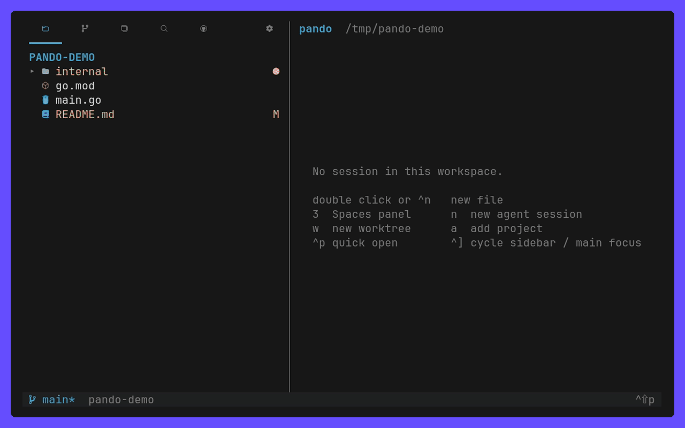
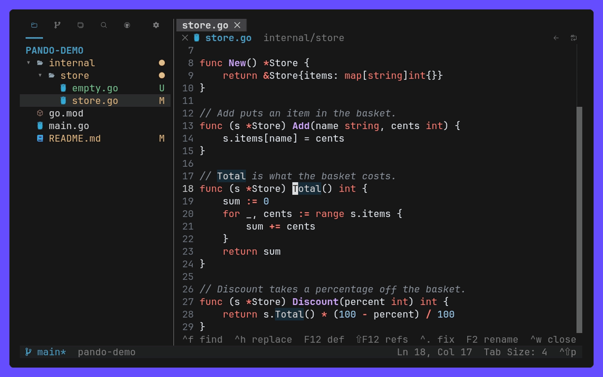
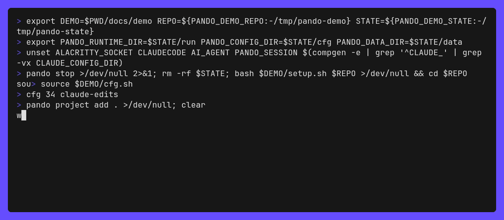

<h1 align="center">
    🌳 pando
</h1>

<p align="center">
    A terminal workspace for AI agent sessions: run Claude, Codex or any shell
    across several projects and git worktrees at once, and review what they
    changed with VS Code's diffs, all in one TUI.
</p>



## Why

I wanted Zed's agent sessions across several projects at once. herdr does that
and has an API to drive them, but reviewing what they changed still meant
another tool, and the diffs I like reading are VS Code's. pando is the three:

- **Zed**: sessions side by side over many projects, each in its own worktree.
- **herdr**: a daemon that keeps them alive, and a socket API to drive them.
- **VS Code**: Source Control, diffs and an editor next to the session.

[Pando](https://en.wikipedia.org/wiki/Pando_%28tree%29) is the aspen colony in
Utah: thousands of trunks, one root system. Every session is a stem; one
daemon keeps them all alive.

## Features

- **Agent sessions**: projects → worktrees → sessions, each with shell tabs,
  marked when they need you, resumed after a daemon restart.
- **Source Control**: VS Code's view — line-level staging, Commit & Sync,
  Publish, AI commit messages, history drawers.
- **Diffs**: inline or side by side, word-level highlights, a file's
  revisions stepped through like GitLens.
- **Editor**: undo, find & replace, suggestions, format on save, vim mode,
  unsaved drafts that survive a restart, language servers.
- **Explorer and Search**: git decorations, VS Code's context menu, quick
  open, workspace search & replace.
- **GitHub**: with `gh` installed, pull requests, issues and notifications as
  VS Code's GitHub Pull Requests view lists them; a pull request opens in the
  editor or checks out in a worktree of its own.
- **Layout**: a terminal panel, draggable views and columns, VS Code's 2026
  themes, remappable keys.
- **CLI and API**: JSON over a unix socket; self-update on Linux and macOS.

## Install

```sh
curl -fsSL https://raw.githubusercontent.com/xseman/pando/master/install.sh | sh
```

Verifies the binary against `CHECKSUMS.txt` and installs to `~/.local/bin`
(`PANDO_VERSION` pins a release, `PANDO_INSTALL_DIR` moves it). From source:
`make install` (Go 1.26).

```sh
pando            # the project opened last, or the current directory
pando ~/code/app # add a directory to the projects and open it
```

Needs git. Optional: `rg` for search, language servers (`gopls`, …), the
`claude` CLI for commit messages, and Nerd Font glyphs for `icons = "nerd"` —
a patched main font is not needed, _Symbols Nerd Font Mono_ as a fallback is
enough. `pando doctor` shows which font draws each icon.

## How it works

```
pando (TUI) ──┐
pando (CLI) ──┼── unix socket, JSON ──▶ daemon ──▶ sessions (PTY) in git worktrees
agents      ──┘                           │
                                          └──▶ config.toml, state.json
```

One daemon keeps the sessions alive; the TUI and the CLI are clients of the
same API, so every attached TUI follows a change made anywhere. Sessions get
`PANDO_SESSION` and `PANDO_RUNTIME_DIR`, so an agent inside one can drive
pando too.

## Usage

### Sessions

Spaces is a tree of projects → worktrees (`⌂` the checkout, `⑂` linked) →
sessions. `n` (or `+`) opens a shell in the worktree; run `claude`, `codex` or
anything in it. `w` adds a worktree, `x` kills a session, deletes a worktree
(the branch stays) or closes a project (its checkout is never removed).

- A session opens in a column beside the editor; drag it to the other side,
  over the editor, or nearly off screen to hide it (it keeps running).
  Switching to it re-roots Files and Source Control to its worktree.
- Each session has shell tabs (`+`, `[` `]`) and its own Terminal panel
  shells; drag sessions and worktrees (or `alt+↑↓`) to reorder.
- Drag any tab along its strip to reorder it — editors, a session's tabs, the
  Terminal's shells: a `│` marks where it lands on release. `ctrl+shift+pgup`
  `ctrl+shift+pgdn` move the focused one, wrapping at either end. A session's
  own tab stays first.
- `×` waits for you, `◐` works, `✓` finished unseen, `○` idles. One that needs
  you pulses until clicked and can play a sound (`session_highlight`,
  `sounds`). `o` filters, sorts and groups the list.
- Drag over a terminal to select; the release copies. `ctrl+f` finds in its
  scrollback.

**Resume.** On a daemon restart each session comes back as its shell and pando
types the command that continues the agent it held: `claude` (by conversation
id), `codex resume --last` and `opencode --continue` out of the box, anything
else is one line. A conversation still open elsewhere is not opened twice, and
a custom config dir (`CLAUDE_CONFIG_DIR`, `CODEX_HOME`) comes back with it.

```toml
[resume]
aider = ["aider", "--restore-chat-history"]
```



A restart still stops what runs in the terminal, subagents included.
`pando claude` starts claude as a Claude Code background session attached to
the terminal, which outlives it; with `claude_background` (the default) every
resumed claude comes back that way.

### Source Control and diffs

VS Code's layout: Merge / Staged / Changes / Untracked as a list or tree, a
growing message box, and drawers for the graph, commits, file history,
branches, worktrees, remotes, stashes and tags.

- The button is Commit, then _Publish Branch_ (to a remote, or a new GitHub
  repository through `gh`) or _Sync Changes_, and _Continue_ during a merge,
  rebase or cherry-pick.
- The message box's ∨ (or `A`) has `claude` write the message: a subject, with
  a description, in the repository's style, a rewrite, or another take.
- Diffs are inline or side by side (`s`); selected lines stage, unstage or
  revert from either.



### GitHub

Shown where `gh` is on the PATH (`6`), for the repository `gh` picks in the
workspace: Pull Requests (Local Pull Request Branches, Waiting For My Review,
Assigned To Me, Created By Me, All Open) with their checks, Issues (My,
Created, Recent) and unread Notifications. A folder asks `gh` when it is
unfolded; `^r` asks again.

| Key | On a pull request                        | On an issue                  | On a notification |
| --- | ---------------------------------------- | ---------------------------- | ----------------- |
| `⏎` | its description, rendered, in the editor | the same                     | opens, marks read |
| `d` | its changes, `gh pr diff`                |                              |                   |
| `w` | checks out in a worktree of its own      | a new worktree `issue/<n>-…` |                   |
| `o` | on github.com; `y` copies the link       | the same                     | the same          |
| `x` |                                          |                              | Mark as Done      |

Merge, in the `m` menu, asks how and merges only the head the list showed.
Create Pull Request and Sign in run `gh` in a new Terminal tab, where it asks
its own questions.



### Editor

Undo, find & replace, go to line and symbol, merge-conflict _Accept_ actions,
suggestions as you type, `ctrl+shift+v` rendered Markdown (`alt+v` beside the
source), vim mode (`vim_mode = true`, a key layer: motions, operators, visual).
Unsaved text, untitled buffers included, is kept in
`~/.local/share/pando/drafts/` and comes back with its tab. A file changed on
disk is never overwritten silently.

`ctrl+shift+i` formats (and `ctrl+s` with `format_on_save`); Go uses `gofmt`:

```toml
[format]
ts = ["prettier", "--stdin-filepath", "$FILE"]  # by extension
python = ["black", "-q", "-"]                   # by language id
```

**Language servers**: `F12` definition, `shift+F12` references, `ctrl+.` code
actions, `F2` rename, `ctrl+shift+o` symbols, completions. Go and
TypeScript work once `gopls` or `typescript-language-server` is on `PATH`
(a project's `node_modules/.bin` wins); others are one line. No diagnostics.

```toml
[lsp]
zig = ["zls"]                                  # by extension
python = ["pyright-langserver", "--stdio"]     # by language id
```



### Layout and settings

``ctrl+` ``, `ctrl+j` or `5` toggles the terminal panel (in a terminal only
``ctrl+` ``); `ctrl+shift+↑` maximizes it. Drag a view's tab to reorder it,
move it to another sidebar or give it a column; drag a divider to resize.

Settings live in `~/.config/pando/config.toml`, commented in the file; `ctrl+,`
edits them and every change applies live. The common ones:

| Key                              | Values                                                       |
| -------------------------------- | ------------------------------------------------------------ |
| `color_theme`                    | `vscode` (auto), `vscode-dark`, `vscode-light`, `terminal`   |
| `icons`                          | `ascii` (default), `nerd`, `emoji`                           |
| `diff_view`                      | `inline`, `split`                                            |
| `word_wrap`, `vim_mode`          | `false` by default                                           |
| `render_whitespace`              | `selection` (default), `boundary`, `trailing`, `all`, `none` |
| `markdown_width`, `editor_limit` | `80`, `0` (no limit)                                         |
| `[colors]`, `[keys]`             | overrides, by the names `pando doctor` prints                |

The full list is in [docs/06-config.md](docs/06-config.md).

### Updates

The daemon checks GitHub once a day (`update_check`); a newer version shows in
the status bar, and a click (or `pando update`) downloads and verifies it. It
runs after a restart.

More recordings: [editor](docs/demo/edit.gif) · [vim](docs/demo/vim.gif) ·
[Markdown](docs/demo/markdown.gif).

## Keys

| Key                  | Action                                                    |
| -------------------- | --------------------------------------------------------- |
| `ctrl+]`             | cycle focus; in a session every other key goes to the app |
| `1`–`4`, `6`         | Files, Git, Spaces, Search, GitHub                        |
| `ctrl+shift+p`, `F1` | command palette                                           |
| `ctrl+p`             | quick open (`:` line, `@` symbol)                         |
| `alt+t`, `[` `]`     | go to a session, previous / next                          |
| `m`, right click     | context menu                                              |
| `?`                  | every key of every view                                   |

All of them: [docs/09-keys.md](docs/09-keys.md).

## CLI

Every command talks to the daemon and prints JSON; `pando help` lists them.

```
pando session new --agent claude --ws ../repo-feat --name fix --wait
pando session new --ws . -- npm run dev              # any command
pando session send fix 'fix the failing test' --wait --timeout 180000
pando session wait fix --until blocked --timeout 60000
pando session keys fix esc                           # esc ctrl+c shift+tab …
pando session read fix --lines 120
pando session ls | get fix | switch fix | kill fix   # ID, name, or a prefix
pando ws new [feat-x] --project .                    # a worktree, random branch without a name
pando project move ~/code/app 0
pando open README.md | pando set diff_view split
pando call METHOD '{"json":"params"}'                # raw API
```

`--wait` blocks until the session is idle, blocked or exited, so nothing
polls. The API covers sessions, workspaces, projects and settings; for diffs,
commits and search a script uses git. `pando skill` prints
[skills/pando/SKILL.md](skills/pando/SKILL.md), the guide for an agent driving
pando.



## Files

| Path                                | Content                                              |
| ----------------------------------- | ---------------------------------------------------- |
| `$XDG_RUNTIME_DIR/pando/pando.sock` | API socket, `daemon.log`                             |
| `~/.config/pando/config.toml`       | settings, agent presets; edits apply live            |
| `~/.config/pando/state.json`        | projects, open editors, commit drafts, session specs |
| `~/.local/share/pando/worktrees/`   | worktrees created by pando                           |
| `~/.local/share/pando/drafts/`      | unsaved editor text                                  |

`PANDO_RUNTIME_DIR`, `PANDO_CONFIG_DIR` and `PANDO_DATA_DIR` override them. A
restart respawns sessions, not their scrollback.

## Docs

| Doc                                        | Contents                                                     |
| ------------------------------------------ | ------------------------------------------------------------ |
| [01 Architecture](docs/01-architecture.md) | daemon, socket protocol, sessions, packages                  |
| [02 UI layout](docs/02-ui-layout.md)       | columns, rows, mouse geometry, modals                        |
| [03 Views](docs/03-views.md)               | Explorer, Git, Spaces, resume, Terminal, Search, GitHub      |
| [04 Preview](docs/04-preview.md)           | diffs, editor, Markdown, find, LSP, staging lines, revisions |
| [05 Git](docs/05-git.md)                   | status, worktrees, branches, the index, gh                   |
| [06 Config](docs/06-config.md)             | config.toml, state.json, every setting, colors               |
| [07 Testing](docs/07-testing.md)           | test layers, interactive checks, demo recordings             |
| [08 Release](docs/08-release.md)           | release-please, artifacts, install script, self-update       |
| [09 Keys](docs/09-keys.md)                 | every key, per view and in a file                            |

## Development

```
make test                    # go vet + go test -race ./...  (CI)
make lint                    # golangci-lint                  (CI)
make fmt                     # gofumpt -w .
go test -short ./...         # skip the end-to-end TUI test
make demo                    # re-record docs/demo/*.gif; one: make demo-lsp
```

Recording needs `vhs` v0.10–v0.11, `ttyd`, `ffmpeg`, Chrome, `jq`, `gopls`
and `claude`; see [docs/07-testing.md](docs/07-testing.md#demo-recordings).
