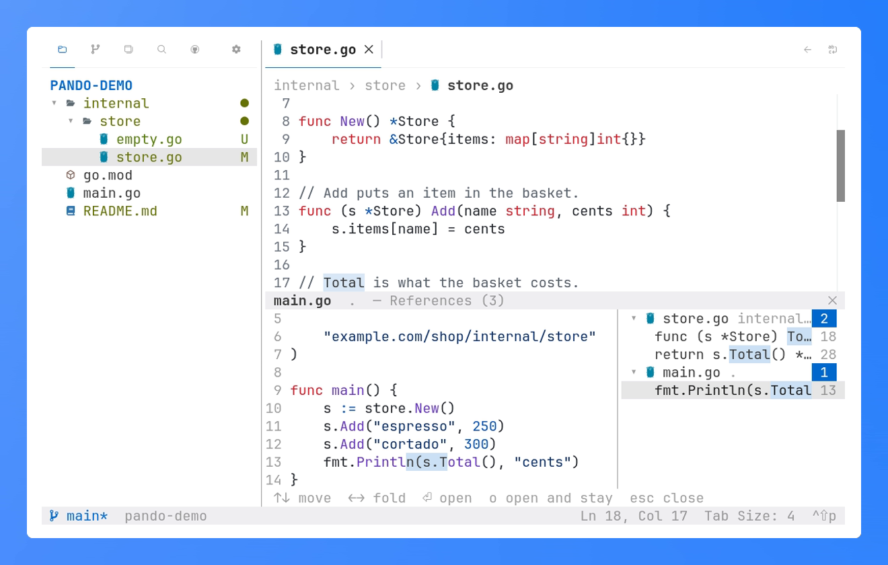

<h1 align="center">
    🌳 pando
</h1>

<p align="center">
    A terminal workspace for AI agent sessions: run Claude, Codex or any shell
    across several projects and git worktrees at once, and review what they
    changed with VS Code's diffs, all in one TUI.
</p>

<p align="center">
    <a href="#install">Install</a> · <a href="#tour">Tour</a> · <a href="docs/usage.md">Usage</a> ·
    <a href="docs/09-keys.md">Keys</a> · <a href="#docs">Docs</a>
</p>

## Why

I wanted to run several coding agents at once, each on its own branch, and
review what they changed without leaving the terminal. pando takes one idea
from each of three tools:

- **[Zed](https://zed.dev)**: its agent panel runs agent sessions beside the
  code; pando runs them side by side over many projects, each in a git worktree.
- **[herdr](https://github.com/ogulcancelik/herdr)**: a terminal multiplexer
  for coding agents; pando borrows its design, not its code: a daemon that
  holds the sessions and a socket API that drives them.
- **[VS Code](https://code.visualstudio.com)**: Source Control, its diffs and
  an editor, right next to the session.

Named after [Pando](https://en.wikipedia.org/wiki/Pando_%28tree%29), the aspen
colony with thousands of trunks on one root: many sessions, one daemon.

## Install

```sh
curl -fsSL https://raw.githubusercontent.com/xseman/pando/master/install.sh | sh
```

Linux and macOS. The script verifies the binary against `CHECKSUMS.txt` and
installs it to `~/.local/bin` (`PANDO_VERSION` pins a release,
`PANDO_INSTALL_DIR` moves it). From source: `make install` (Go 1.26).

Needs git. Optional: `gh` for GitHub, `rg` for search, language servers
(`gopls`, …), the `claude` CLI for commit messages, and a Nerd Font for
`icons = "nerd"` (_Symbols Nerd Font Mono_ as a fallback font is enough).



## Features

- **Agent sessions**: projects → worktrees → sessions, each with shell tabs,
  marked when they need you, resumed after a daemon restart.
- **Source Control**: VS Code's view — line-level staging, Commit & Sync,
  Publish, AI commit messages, history drawers, GitLens-style commit and pull
  request comparisons.
- **Diffs**: inline or side by side, word-level highlights, a file's
  revisions stepped through like GitLens.
- **Editor**: undo, find & replace, suggestions, format on save, vim mode,
  unsaved drafts that survive a restart, language servers.
- **Explorer and Search**: git decorations, VS Code's context menu, quick
  open, workspace search & replace.
- **GitHub**: with `gh` installed, pull requests, issues and notifications as
  VS Code's GitHub Pull Requests view lists them; a pull request opens in the
  editor or checks out in a worktree of its own.
- **Layout**: a terminal panel, draggable views and columns, VS Code's 2026
  themes, remappable keys.
- **CLI and API**: JSON over a unix socket; self-update on Linux and macOS.

## Quick start

```sh
pando ~/code/app   # add a project and open it; plain `pando` reopens the last
```

| Key      | Does                                                           |
| -------- | -------------------------------------------------------------- |
| `3`      | Spaces: your projects, worktrees and sessions                  |
| `w`      | a new worktree for the selected project                        |
| `n`      | a new session in the worktree: pick an installed agent         |
| `ctrl+]` | move focus out of the session; inside it every key goes to it  |
| `2`      | Source Control for the session's worktree: review and commit   |
| `?`      | every key of every view                                        |


## Tour

### Resume

Stop the daemon, start pando again: every session comes back and its agent
continues the same conversation. [More](docs/usage.md#resume)


### Review and commit

Diffs inline or side by side, staging single lines, and merge conflicts with
VS Code's accept actions. [More](docs/usage.md#review-and-commit)


### GitHub

Pull requests with their checks, opened as a description or a diff, checked
out in a worktree of their own. [More](docs/usage.md#github)


### Language servers

References in a peek, code actions, rename and completion, from `gopls` or
any server you configure. [More](docs/usage.md#editor)


### Editor

Untitled buffers, save with path completion, format on save.


### Vim mode

`vim_mode = true`: normal, visual and insert modes in every editor.


### Markdown

Source, rendered, or both side by side scrolling together.


### CLI

Everything a session does is a command, so a script or another agent can run
one and wait for its turn to end. [More](docs/usage.md#cli)


## How it works

```text
pando (TUI) ──┐
pando (CLI) ──┼── unix socket, JSON ──▶ daemon ──▶ sessions (PTY) in worktrees
agents      ──┘
```

One daemon owns the sessions; the TUI and the CLI are its clients, so closing
the TUI leaves every agent running, and every attached TUI follows a change
made anywhere.

## Docs

| Doc                                      | For                                                  |
| ---------------------------------------- | ---------------------------------------------------- |
| [Usage](docs/usage.md)                   | the user guide: sessions, review, editor, CLI, files |
| [Settings](docs/06-config.md)            | `config.toml`, every setting, colors, keys           |
| [Keys](docs/09-keys.md)                  | every key, per view and in a file                    |
| [Agent guide](skills/pando/SKILL.md)     | driving pando from an agent; `pando skill` prints it |
| [Architecture](docs/01-architecture.md)  | daemon, socket protocol, sessions, packages          |

Contributors: [UI layout](docs/02-ui-layout.md) ·
[views](docs/03-views.md) · [preview](docs/04-preview.md) ·
[git](docs/05-git.md) · [testing](docs/07-testing.md) ·
[release](docs/08-release.md).
