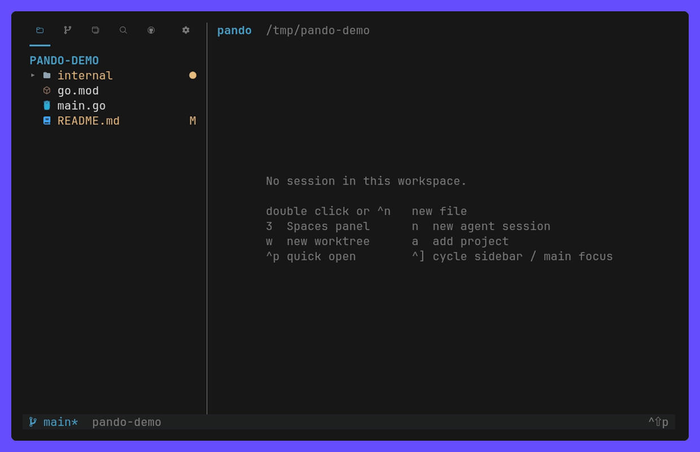
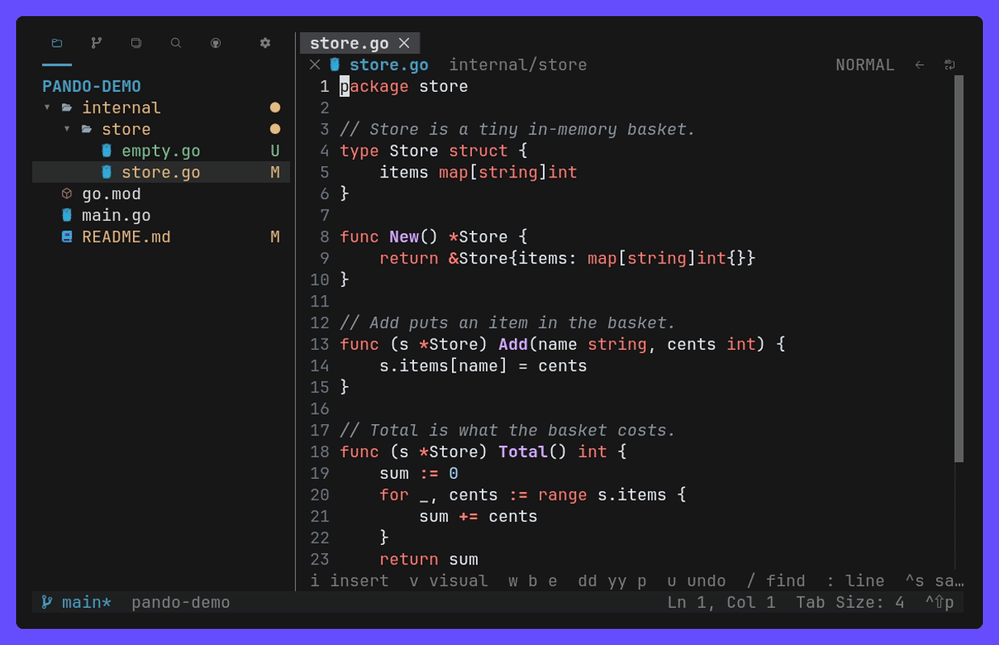
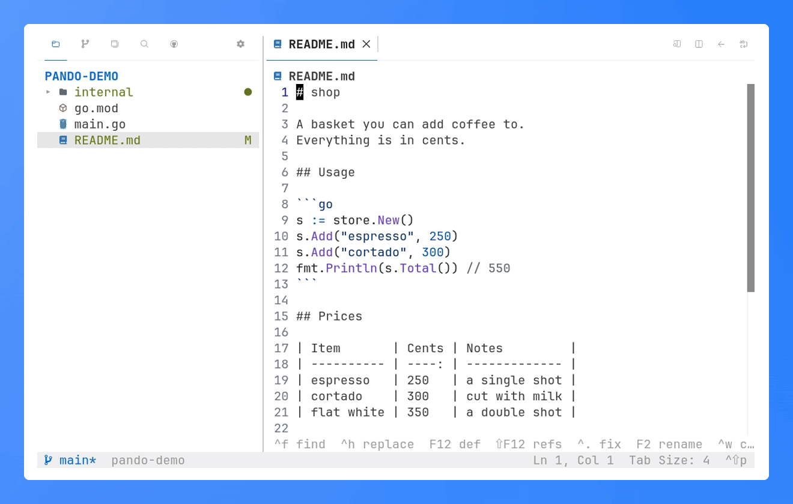

# Using pando

The user guide. Settings: [06-config.md](06-config.md); keys:
[09-keys.md](09-keys.md).

- [Projects, worktrees, sessions](#projects-worktrees-sessions)
- [The screen](#the-screen)
- [Sessions](#sessions)
- [Resume](#resume)
- [Review and commit](#review-and-commit)
- [GitHub](#github)
- [Editor](#editor)
- [Settings, keys, updates](#settings-keys-updates)
- [CLI](#cli)
- [Files](#files)

## Projects, worktrees, sessions

Spaces (`3`) is a tree: projects you added, their worktrees, and the
sessions in each worktree.

```text
app                      project: pando ~/code/app, or `a` in Spaces
├─ ⌂ main                its own checkout
│  ├─ ○ shell            session: idle
│  └─ ◐ claude           session: working
└─ ⑂ feat-login          linked worktree, `w`
   └─ × claude           session: waits for you
```

| Key      | In Spaces                                                       |
| -------- | --------------------------------------------------------------- |
| `w`      | add a worktree to the selected project                          |
| `n`      | open a shell in the worktree (or click `+`); run an agent in it |
| `x`      | kill a session, delete a worktree, or close a project           |
| `o`      | filter, sort and group the list                                 |
| `alt+↑↓` | reorder sessions and worktrees                                  |

Deleting a worktree keeps its branch; closing a project never removes its
checkout.

## The screen

```text
┌────────┬────────────────┬──────────────────────┬──────────────────┐
│ SPACES │ Files Git ⌕    │ main.go │ notes.md   │ claude           │
│ ▾ app  │ ▾ src          │                      │                  │
│  ⌂ main│    main.go   M │   editor or diff     │   session        │
│   ◐ fix│                │                      │   (its own PTY)  │
│  ⑂ feat│                ├──────────────────────┤                  │
│   × ui │                │ Terminal panel       │                  │
├────────┴────────────────┴──────────────────────┴──────────────────┤
│ status bar: branch, sync, agents waiting, updates                 │
└───────────────────────────────────────────────────────────────────┘
```

- `ctrl+]` cycles focus; inside a session every other key goes to its program.
- `1`–`4` and `6` open Explorer, Source Control, Spaces, Search and GitHub.
- ``ctrl+` ``, `ctrl+j` or `5` toggles the Terminal panel; `ctrl+shift+↑`
  maximizes it.
- Drag a view's tab to move it, a divider to resize. A second click on the
  open view's icon hides its sidebar; `ctrl+b` hides both.

## Sessions

- A session opens in a column beside the editor. Drag it to the other side,
  over the editor, or off screen to hide it; it keeps running.
- A session re-roots Explorer and Source Control to its worktree.
- Each session has shell tabs (the strip's `+`) and its own Terminal panel.
  `[` `]` step through its tabs; `alt+t` picks a session.
- Drag over a terminal to select and copy; `ctrl+f` finds in its scrollback.

| Mark | State     | Means                                                     |
| ---- | --------- | --------------------------------------------------------- |
| `×`  | `blocked` | waits for you: a permission or a question                 |
| `◐`  | `running` | works; a shell command it runs, in the background too     |
| `✓`  | `done`    | finished, not looked at yet                               |
| `○`  | `idle`    | at its prompt                                             |
| `✕`  | `exited`  | failed (`exit N`); a clean exit closes the session        |

One needing you pulses until clicked (`session_highlight`) and can
play a sound (`sounds`).


## Resume

After a daemon restart pando types into each session's shell what resumes
its agent: `claude --resume` with its conversation id (`claude --continue`
without one), `codex resume --last`, `opencode --continue`. Others take one
line:

```toml
[resume]
aider = ["aider", "--restore-chat-history"]
```

- A conversation still open elsewhere is not opened twice.
- A custom config dir (`CLAUDE_CONFIG_DIR`, `CODEX_HOME`) comes back with it.
- Scrollback is not kept, and what ran in the terminal stops, subagents
  included. `pando claude` starts claude as a Claude Code background session,
  which outlives the restart; with `claude_background` (the default) every
  resumed claude comes back that way.


## Review and commit

Source Control (`2`) follows VS Code: Merge / Staged / Changes / Untracked,
a message box, and drawers for the graph, commits, file history, branches,
worktrees, remotes, stashes and tags.

| Key       | In Source Control                                          |
| --------- | ---------------------------------------------------------- |
| `⏎`       | stage or unstage the file; `o` opens its diff              |
| `a` / `u` | stage / unstage all; `U` stages the untracked              |
| `d`       | discard the file or the section, after asking              |
| `c`       | focus the message box; `A` has `claude` write the message  |
| `C`       | commit                                                     |
| `S`       | sync, or publish a branch with no upstream                 |

In a diff, `s` switches inline and side by side, and selected lines stage,
unstage or revert (`m`). The commit button turns into _Continue_ during a
merge, rebase or cherry-pick.


## GitHub

Shown when `gh` is on the `PATH` (`6`): Pull Requests with their checks,
Issues and unread Notifications for the repository `gh` picks.

| Key | Does                                                             |
| --- | ---------------------------------------------------------------- |
| `⏎` | renders a pull request or issue; opens a notification, read      |
| `d` | a pull request's changes, `gh pr diff`                           |
| `w` | a worktree for the pull request, or `issue/<n>-…` for an issue   |
| `o` | opens github.com; `y` copies the link                            |
| `x` | marks a notification done                                        |

Merge is in the `m` menu and merges only the head the list showed.


## Editor

- Undo, find & replace, quick open (`ctrl+p`, `:` line, `@` symbol),
  suggestions, merge-conflict _Accept_ actions.
- `ctrl+shift+v` renders Markdown, `alt+v` beside the source.
- `vim_mode = true` adds motions, operators and visual mode.
- Unsaved text is kept as a draft and comes back with its tab; a file changed
  on disk is never overwritten silently.
- `ctrl+shift+i` formats, `ctrl+s` too with `format_on_save`. Go uses `gofmt`.







**Language servers.** `F12` definition, `shift+F12` references, `ctrl+.` code
actions, `F2` rename, `ctrl+shift+o` symbols, completions; no diagnostics.
Go and TypeScript work once `gopls` or `typescript-language-server` is on the
`PATH`; others go in `[lsp]` and `[format]`
([06-config.md](06-config.md#language-servers-and-formatters)).


## Settings, keys, updates

Settings live in `config.toml`, commented in the file. `ctrl+,` edits them,
grouped as Appearance, Explorer, Source Control, Editor and Sessions,
`pando set KEY VALUE` changes one from a shell, and every change applies live
in every attached TUI. Keys remap in its `[keys]` table, by command id
([06-config.md](06-config.md#keys)); every default key:
[09-keys.md](09-keys.md).

The cursor's shape and blink are your terminal's, so set them there; an app in
a session may change them, as it would outside pando.

The daemon checks GitHub once a day (`update_check`). A newer version shows
in the status bar; a click or `pando update` installs it, verified, for the
next start.

## CLI

Every command talks to the daemon and prints JSON, bar `session read` (text)
and `project ls` (paths); `pando help` lists them.

```sh
wt=$(pando ws new feat-x --project . | jq -r .path)  # a new worktree
pando session new --agent claude --ws "$wt" --name fix --wait
pando session send fix 'fix the failing test' --wait
pando session wait fix --until blocked --timeout 60000
pando session read fix --lines 120
pando call METHOD '{"json":"params"}'                # raw API
```

`--wait` blocks until the session is idle, blocked or exited, so nothing
polls. The API covers sessions, workspaces, projects and settings; diffs and
commits are git's. A session gets `PANDO_SESSION`, so an agent inside one can
drive pando too: `pando skill` prints [the agent guide](../skills/pando/SKILL.md).


## Files

| Path                              | Holds                                     |
| --------------------------------- | ----------------------------------------- |
| `$XDG_RUNTIME_DIR/pando/`         | `pando.sock`, `daemon.log`                |
| `~/.config/pando/config.toml`     | settings, agent presets                   |
| `~/.config/pando/state.json`      | projects, open editors, session specs     |
| `~/.local/share/pando/worktrees/` | worktrees created by pando                |
| `~/.local/share/pando/drafts/`    | unsaved editor text                       |

On macOS the config lives in `~/Library/Application Support/pando`.
`PANDO_RUNTIME_DIR`, `PANDO_CONFIG_DIR` and `PANDO_DATA_DIR` override them.
